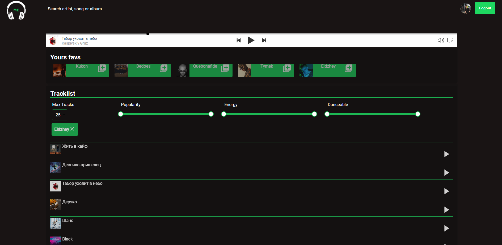
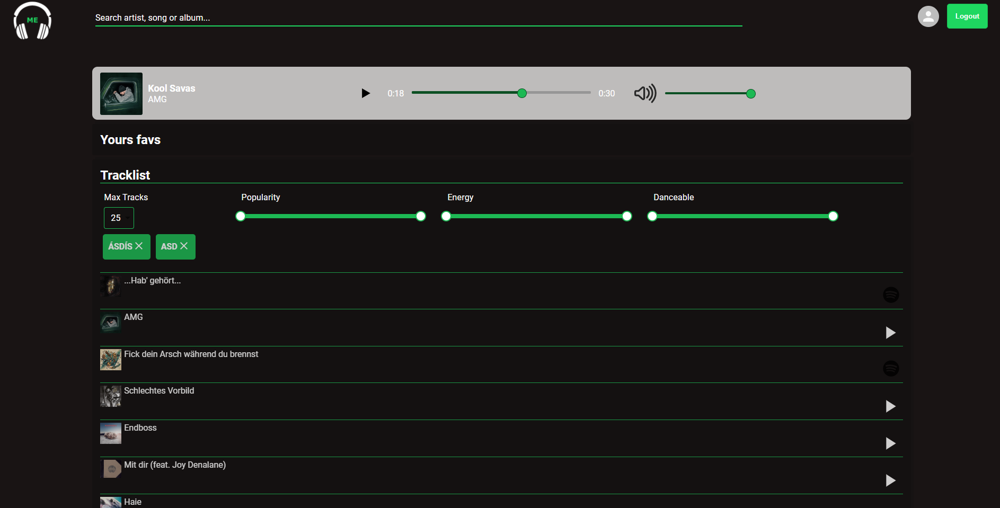
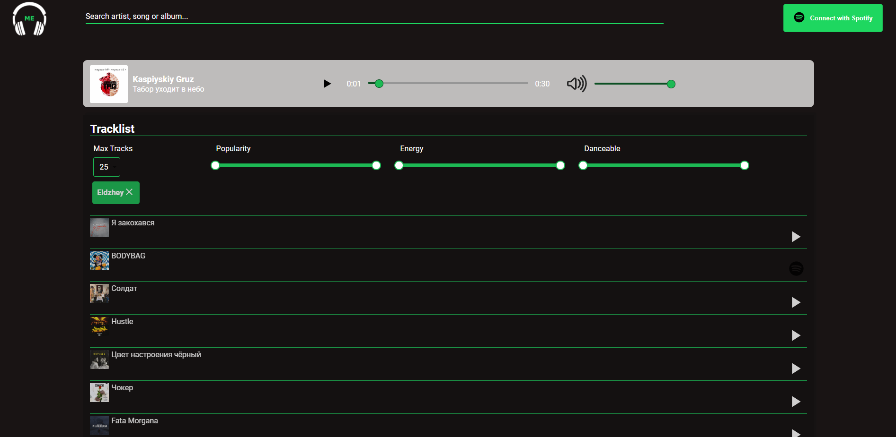

# Music Earrings

## [Live demo](https://music-earrings.herokuapp.com/)

API goes to sleep after 30 minutes of inactivity. Therefore, the first login may take longer.

## Description

**The Music Earrings** web application will serve as a lightweight music player that will replace the standard Spotify player. The application will use the Spotify API.

[link to Spotify API](https://developer.spotify.com/)

## Languages & tools

**Language:** JavaScript

**Framework:** React + Redux

**Framework backend:** Express

**Other tools:**

- Styled-components
- MaterialUI
- Jest + Enzyme (tests)
- Axios

# Project Status

The project is almost ready, there are two things to do.

**Features:**

- OAuth with spotifyApi **(Done)**
- Standard search for songs/artists/albums **(Done)**
- Standard music player (When I have a premium account on spotify we can use full replay. With a regular account or not logged in, we can only listen to 30 seconds of the song) **(Done)**
- Generating a playlist based on given artists, the ability to save it on your Spotify account **(Done)**
- Check out our current favorites artists **(Done)**
- Unit and integration tests **(In progress)**

# Installation and Setup Instructions

## Requirements

- [Account on spotify](https://developer.spotify.com/)
- [Node](https://nodejs.org/en/)
- [Yarn](https://yarnpkg.com/)
- [Docker](https://www.docker.com/)
- [Docker-Compose](https://docs.docker.com/compose/)
- [Make](https://www.tutorialspoint.com/unix_commands/make.htm)

## Installation

1. After cloning or extracting the .zip files of this repository:  
   `cd Music-Earrings`

2. Next go to server file and install dependencies:  
   `cd server`  
   `yarn`  
   `cd ..`

3. Next go to client and install dependencies:  
   `cd client`  
   `yarn`  
   `cd ..`

4. After installation of dependencies, you must create .env files, I've already created sample files in the repository, you need to rename them and provide your environment variables.  
   Rename files:  
   `.envGlobal` to `dev.env`  
   `server\.envServer` to `.env`  
   `client\.envClient` to `.env`  
   Enter yours secrets

5. Create docker image and start application:  
   `make build-dev`  
   `make dev`

### Getting Started with Create React App

This project was bootstrapped with [Create React App](https://github.com/facebook/create-react-app).

## Application views

while logged in (Premium user)

while logged in (Normal user)

while logged out
