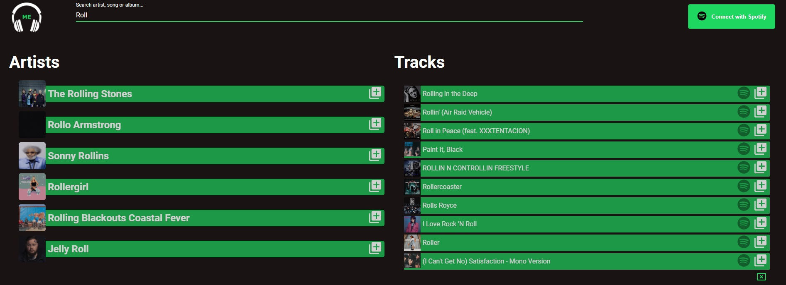
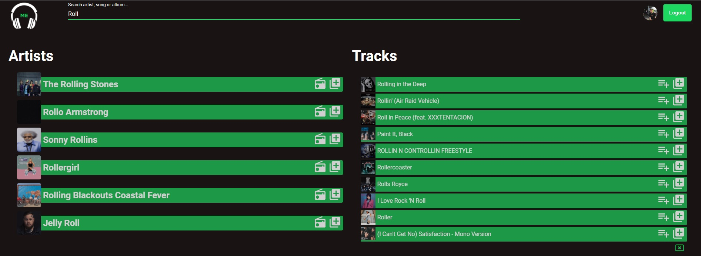

# Music Earrings

## [Live demo](https://music-earrings.herokuapp.com/)

API goes to sleep after 30 minutes of inactivity. Therefore, the first login may take longer.

## Description

**The Music Earrings** web application will serve as a lightweight music player that will replace the standard Spotify player. The application will use the Spotify API.

[link to Spotify API](https://developer.spotify.com/)

## Languages & tools

**Language:** JavaScript

**Framework:** React + Redux

**Framework backend:** Express

**Other tools:**

- Styled-components
- MaterialUI
- Jest + Enzyme (tests)
- Axios

# Project Status

The project is in the process of designing views.

**Features:**

- OAuth with spotifyApi **(Done)**
- Standard search for songs/artists/albums **(Done)**
- Standard music player **(In progress)**
- Generating a playlist based on given artists, the ability to save it on your Spotify account **(Done)**
- Create a queue of songs **(In progress)**
- Check out our current favorites artists **(Done)**
- And other features...

# Installation and Setup Instructions

## Requirements

- [Account on spotify](https://developer.spotify.com/)
- [Node](https://nodejs.org/en/)
- [Yarn](https://yarnpkg.com/)
- [Docker](https://www.docker.com/)
- [Docker-Compose](https://docs.docker.com/compose/)
- [Make](https://www.tutorialspoint.com/unix_commands/make.htm)

## Installation Both

In the directory from the repository, use the command:

### `make install`

## Backend Installation

In the directory **server**, use the command:

### `yarn install`

## Frontend Installation

In the directory **client**, use the command:

### `yarn install`

## Dockerize an application

Build dev images:

### `make build-dev`

Run development server:

### `make dev`

### Getting Started with Create React App

This project was bootstrapped with [Create React App](https://github.com/facebook/create-react-app).

## Application views

Navbar

Navbar while logged in

Search results

Search results while logged in

Our favorite artists while logged in
